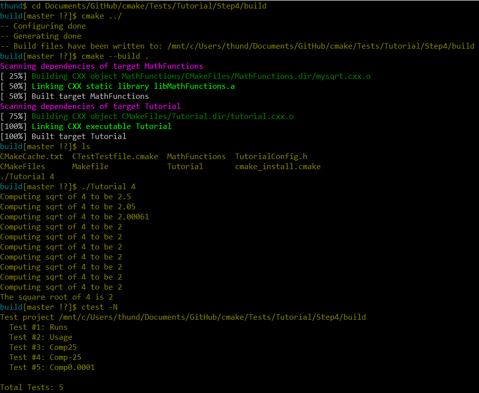
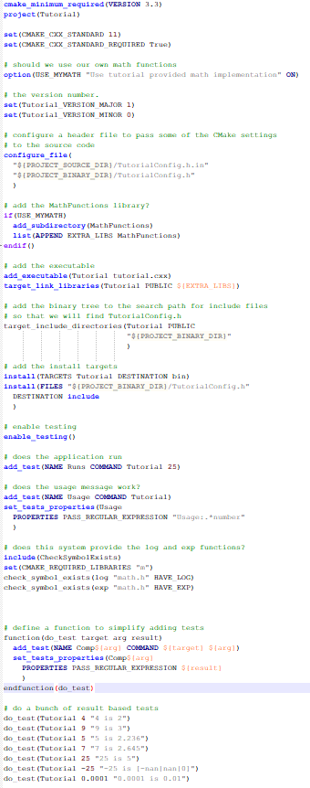
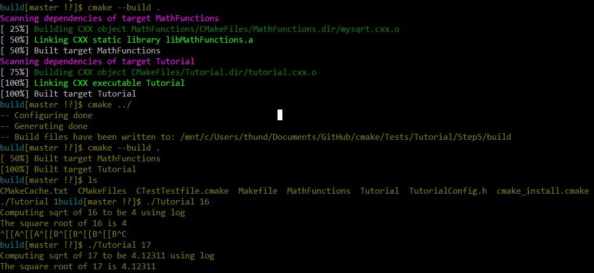

# Lab 5

## Step 1

### Step 1: CmakeLists

### Step 1: Results

## Step 2

### Step 2: CMakeLists

### Step 2: Results

## Step 3

### Step 3: CMakeLists

### Step 3: Results

## Step 4

### Step 4: CMakeLists

### Step 4: Results

## Step 5

### Step 5: CMakeLists

### Step 5: Results

